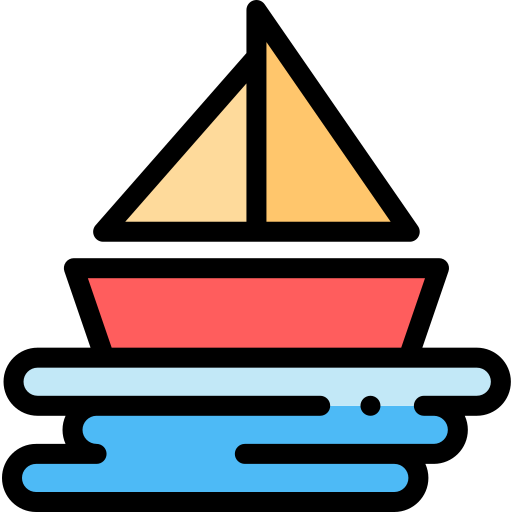

<p align="center">
    
</p>

# Bearing Chart Genearator

[](https://app.netlify.com/sites/bearingchartgen/deploys)

Create your own bearing charts for quick reference while sailing!
Generates a chart of all bearings to/from a list of user inputted marks based on their lat/long co-ordinates. Allows download of this chart in both PDF and CSV format.

## :rocket: Motivation 
Had to create one of these charts myself for a sailing event and couldn't find a simple generator online. Also was about to create a "dummy" site to explore/work with some new technologies anyway. Combined the two to create something that might be useful to people, including myself!

## :computer: Demo 
Site is live at [BearingChartGen](https://bearingchartgen.netlify.com/)

## :hammer: Built with 
* [Gatsby](https://www.gatsbyjs.org/) - Static site generator
* [React](https://reactjs.org/) - Web framework
* [Styled Components](https://www.styled-components.com/) - For bulk of styling
* [Netlify](https://www.netlify.com/) - Hosting
* ..Other bits and pieces!

## :wrench: Local Development 

### Setup
Inside directory to install all dependencies: 
```
npm install
```

### Develop
To start hot-reload server on ```http://localhost:8000```
```
gatsby develop
```

### Build
To build a static site into the ```public``` folder
```
gatsby build
```

### Deploy
Site is hosted on Netlify -> any push/merge to master branch on GitHub will be auto-deployed.
This will automatically run ```gatsby build```

## :mortar_board: Learning / Notes
Very happy with choice of tools in the end - tool a bit of time to get used to the new tech but it all proved worth it.
- Gatsby was great, makes routing react very straightforward and seems to remove a lot of the "tedious" tasks.
- Have worked with React a good bit before but this was my first solo project with it. Feel like I've got a good grasp on the fundamentals now and am happy with the outcome.
- StyledComponents were a struggle to adapt to but understand their elegance now - think I need to explore global styling using them a bit further, and also look into when exactly to move to them from inline styling (e.g: is one or two styles inline better than a new styled component?)
- Netlify was a dream to work with - still shocked by how simple that process was.

## :round_pushpin: Future goals 
- Make single mark tables collapsible
- Store calculated bearings rather than calculate twice on resize
- Magnetic variation allowance
- CSV download on small screens
